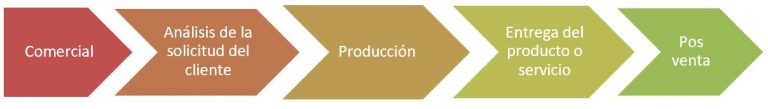

# DE06-Definición de proceso

## ¿Qué es un proceso?

Un proceso es una secuencia de tareas que se realizan de forma ordenada, es decir de forma seguida una detrás de la otra para alcanzar un objetivo

## ¿Cúal es el proposito o el objetivo de tener procesos en tu organización?

En una organización la suma de varios procesos tiene como resultado la entrega de un producto o solución a un cliente. Lo ideal en una organización es tener dibujado un [mapa de procesos](https://app.diagrams.net/#G1XP29gBirYzY_WuWM-eaHaefx2BdzLPDs) para a partir del cual tener bien claro qué proceso se considera operativo y qué proceso se considera de apoyo

## ¿Cúales son los procesos de una organización?

- **Proceso comercial**: en el cual un cliente solicita un servicio o producto a la organización
- **Proceso análisis de la solicitud del cliente**: en el cual se estudia lo que hay que entregar, cómo entregarlo y cuando lo necesita el cliente.
- **Proceso de producción**: en el cual se prepara el servicio o producto que se va a entregar al cliente.
- **Proceso entrega del producto/servicio**: en el cual se entrega el servicio o producto al cliente
- **Proceso postventa**: en el cual se ofrece un soporte para las dudas, sugerencias, quejas o reclamaciones que puedan existir una vez entregado el servicio/producto.

:::info

A grandes rasgos estos son cinco grandes procesos, desde que un cliente solicita un producto/servicio hasta que se entrega y es común para cualquier organización.

:::

Pero como estás viendo se trata de procesos que son muy generales y no especifican concretamente la actividad de una organización.

Eso es evidente porque dentro de esos cinco grandes procesos operativos existen a su vez mas procesos!.

Por ejemplo, es muy probable que para que un cliente solicite un producto, éste deba cumplimentar una toma de datos, formulario o algo similar para que, la organización pueda saber qué es lo que quiere ese cliente, cómo lo quiere y cuándo lo quiere.

## Conclusión

Es importante conocer el mapa de procesos de tu empresa y conocer que se dividen en etapas, asi, al momento de agregar nuevos procesos y subprocesos se conoce la finalidad y los recursos que se necesitan