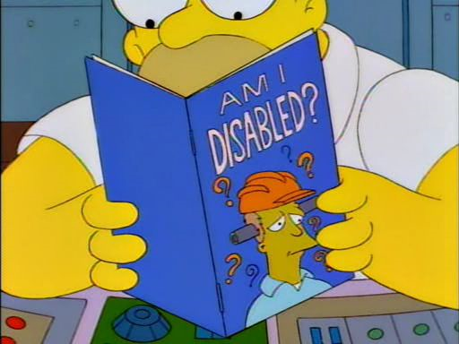

# DE07-Definición de guía

## ¿Qué es una guía?

Una guía es un instrumento con orientación para el usuario, que incluye toda la información necesaria para el correcto y provechoso desempeño de este dentro de las actividades organizacionales y de aprendizaje independiente.

## Características de la guía

- Ofrece información acerca del contenido de las actividades y su relación con el proceso para el cual fue generada.
- Presenta información acerca de la metodologia del proceso y su enfoque.
- Presenta instrucciones de como desarrollar las actividades.
- Orienta la planificación.
- Informa de los criterios que se deben cumplir en el proceso.

## Conclusión

Constituye un instrumento fundamental para la organización del trabajo del usuario y su objetivo es ofrecer todas las orientaciones necesarias que le permitan integrar los elementos para el desarrollo del proceso y un recurso que tiene el propósito de orientar metodológicamente al usuario en su actividad independiente.

## Autores

Alberto Matute Beltrán

## Versiones

| Versión | Descripción      | Responsables   | Fecha      |
| ------- | ---------------- | -------------- | ---------- |
| 1.0     | Creación de definicion | Alberto Matute Beltrán | 22/04/2022 |
