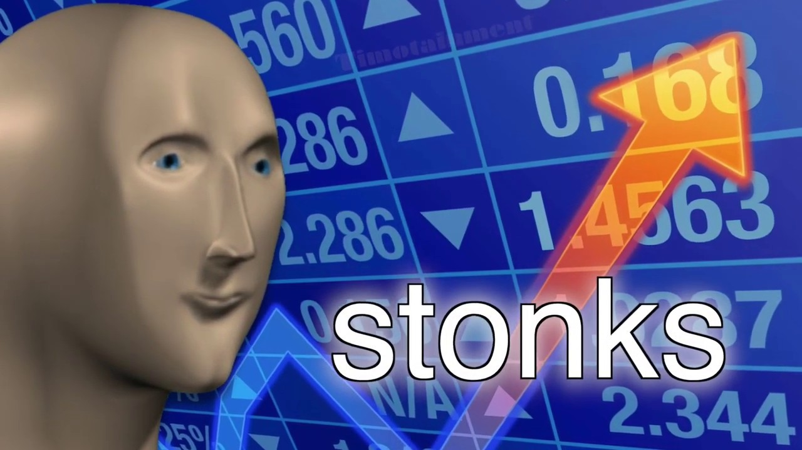

# DE09-Definición de política

## ¿Qué es una política?

Hace referencia a un sistema estructurado y deliberado de principios que **orientan** la toma de decisiones de la empresa y que aspiran a lograr resultados racionales.

En otras palabras, se trata de una declaración de principios.

## ¿Porqué usamos politicas?

Dentro de lo que es una política se sigue un parámetro básico de conducta al que la organización debe adscribirse. También deben hacerlo sus respectivos departamentos para ser fieles a lo que la empresa se plantea como ético o moral.

## Conclusión

Nosotros seguimos políticas porque guian nuestro trabajo para cumplir con nuestros objetivos con la mejor calidad y satisfacción de todos los involucrados.

## Autores

Alberto Matute Beltrán

## Versiones

| Versión | Descripción      | Responsables   | Fecha      |
| ------- | ---------------- | -------------- | ---------- |
| 1.0     | Creación de definicion | Alberto Matute Beltrán | 22/04/2022 |

